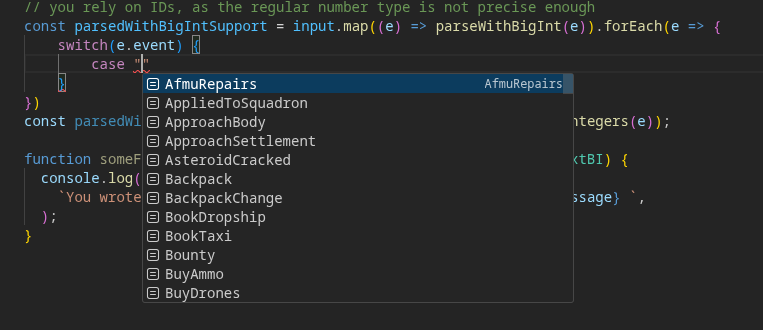
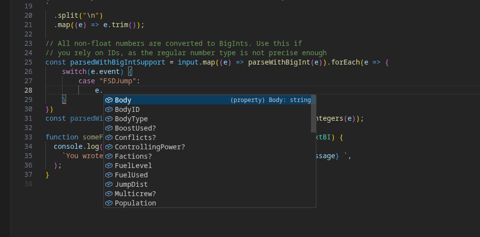

# edpf-journal

This module contains autogenerated Type definitions for the Elite: Dangerous Journal.
This uses https://jixxed.github.io/ed-journal-schemas/ as its source of Schemas.

Besides the Type definitions, this module contains 2 helper functions which will parse the Journal Entry with either BigInts or regular IEEE 754 64-bit floats for integers.

This repository contains the conversion and generator code for https://www.npmjs.com/package/@elite-dangerous-plugin-framework/journal.

## Installation

```sh
npm install @elite-dangerous-plugin-framework/journal
pnpm install @elite-dangerous-plugin-framework/journal
bun install @elite-dangerous-plugin-framework/journal
# or your preferred package manager
```

## Usage

```ts
import {
  parseWithBigInt,
  parseWithLossyIntegers,
} from "@elite-dangerous-plugin-framework/journal";
// if you need type tree-shaking, you can directly import the events individually using their default export.
// This works for regular and "bi" (bigint) event variant.
import type SendText from "@elite-dangerous-plugin-framework/journal/events/SendText";
import type SendTextBI from "@elite-dangerous-plugin-framework/journal/events/bi/SendText";

const input = `
{ "timestamp":"2026-02-01T01:08:59Z", "event":"RefuelAll", "Cost":79, "Amount":1.557032 }
{ "timestamp":"2026-02-01T01:08:59Z", "event":"RepairAll", "Cost":23485 }
{ "timestamp":"2026-02-01T01:09:12Z", "event":"Market", "MarketID":3701213952, "StationName":"V8V-86F", "StationType":"FleetCarrier", "CarrierDockingAccess":"all", "StarSystem":"Lysoorb NH-M d7-26" }
{ "timestamp":"2026-02-01T01:12:50Z", "event":"Music", "MusicTrack":"SystemMap" }
{ "timestamp":"2026-02-01T01:13:40Z", "event":"Music", "MusicTrack":"Exploration" }
{ "timestamp":"2026-02-01T01:13:42Z", "event":"Music", "MusicTrack":"GalaxyMap" }
{ "timestamp":"2026-02-01T01:14:05Z", "event":"Music", "MusicTrack":"Exploration" }
{ "timestamp":"2026-02-01T01:14:19Z", "event":"Shutdown" }
`
  .split("\n")
  .map((e) => e.trim())
  // removing empty lines
  .filter(Boolean)

// All non-float numbers are converted to BigInts. Use this if
// you rely on IDs, as the regular number type is not precise enough
const parsedWithBigIntSupport = input.map((e) => parseWithBigInt(e)).forEach(e => {
    switch(e.event) {
        // parseWithBigInt / parseWithLossyIntegers returns a JournalEvent_BI / JournalEvent
        // it's event property can be switched on, which will give you strong typing for the relevant event.
        case "WingJoin": ...
        case "WingLeave": ...
        case "WingAdd": ...
        case ...
        ...
    }
})
const parsedWithRegularNumbers = input.map((e) => parseWithLossyIntegers(e));

function someFunctionThatWantsAMessageSent(msg: SendText | SendTextBI) {
  console.log(
    `You wrote in channel ${msg.To} at ${msg.timestamp}: ${msg.Message} `,
  );
}
```

`JournalEvent` and `JournalEvent_BI` combine all events into one. It is essentially a huge Type union.
All events have two shared properties: `timestamp` and `event`. You can filter on the `event` field to expose the other properties.



## Versioning

Other than the other packages that reside in the `@elite-dangerous-plugin-framework` namespace, this package uses calendar-versioning.

The Version has the format `0.YYYYMMDD.X` where X is a counter starting at 0 for that specific day in UTC time.

## Contributing

Are some journal items incorrect? Then [please contribute upstream](https://jixxed.github.io/ed-journal-schemas/).
Else, PRs are always welcome.

If you have any questions, please don't hesitate to get into contact. Do note you will get a quicker response by contacting via Discord. Ping `wdx` in the [EDCD Discord](https://discord.gg/zQjjutY) for support.
